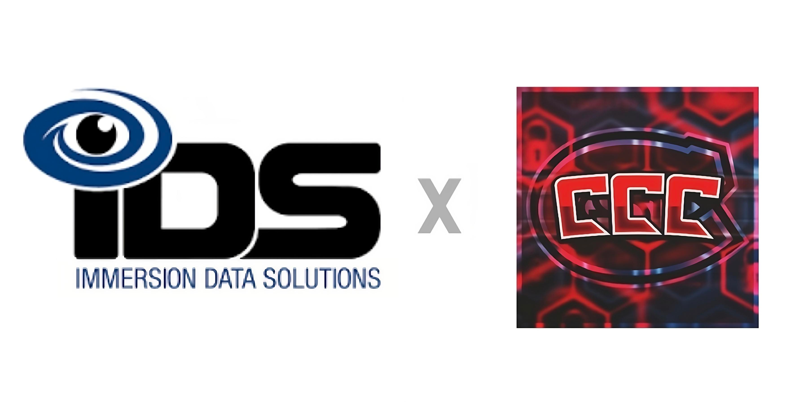
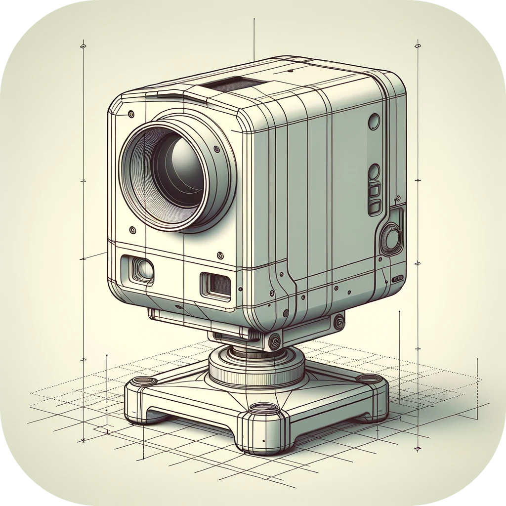

### IDS README Template ↴ 
<!--- | [Full CCC README](README_Resources/CCC_README.md) ⇢ (README_Resources/CCC_README.md) --->

###### Template made by IDS for "CCC" edited by Calvin Schmeichel | SCSU Hackathon Spring 2024

# IDS & SCSU Hackathon Feb. 2024 Challenge 1 - Image Capture Pose Mode

## Team: *CCC (Cyber Competition Club)*
 - *Abdinasir Mumin*  
 - *Abdul-Awwal Adesalu*  
 - *Calvin Schmeichel*  
 - *Joshua Bankers*  
<!--- - *Caroline Camejo-Martir*   --->

 

## Challenge Description
The IDS Capture mobile app is responsible for much of our image capture. An important aspect of a digital twin is to see how it has evolved over time. One way this can be done is with before and after photos. These photos are most impactful when they show the exact same view at different times. To aid our users in capturing the same image at different times, we would like the ability to guide the user in matching the exact position and orientation of a before photo when capturing the after photo.

## Pillar ⇢ Capture

## Technologies ⇢ _React Native, Python, Google Firebase_
<a href="https://reactnative.dev/"> <a href="https://www.python.org/"> <a href="https://firebase.google.com/">

## Test Data ⇢ N/A
_This challenge does not have any test data._

    

## Target Outcome
React native app prototype showcasing capture of a before and after photo, where the capture of the after photo is guided to match the same position and orientation as the before photo.
<!--
## How to Run
*Teams fill in this section with instructions on how to run the application.*

## Hackathon Checklist
 - [ ] Committed all prototype code
 - [ ] Updated README with instructions for running the application
 - [ ] Created presentation showcasing our work
 - [ ] Committed the presentation to the repository root folder in PDF format
 - [ ] *Optional* Team members completed the culture index survey detailed in the below section

## Judging Feedback
*Provided after hackathon judging is completed.*
<!--- Hello! Thank you so much for sponsoring SCSU and helping host the Spring 2024 Hackathon! We had a ton of fun and learned a lot about React Native, Cameras and 3D models. --->

<!---
## Culture Index Survey
Immersion Data Solutions has engaged with a behavior assessment company, Culture Index. We use it to better understand the intrinsic motivational needs and preferred communication style of our team members; ensuring their current roles fit their strengths and fulfillment needs.

We are pleased to offer you the chance to take the assessment and view your results. The process takes roughly 8 minutes or less. By participating, you will gain insights into your own behavioral tendencies and preferences, which can be invaluable for personal and professional development.

[Please begin assessment here.](https://surveys.cultureindex.com/s/jytaqq125Q/48857) Within the 'job title' field, please enter  **SCSU**  and we will share the results with you.
-->
