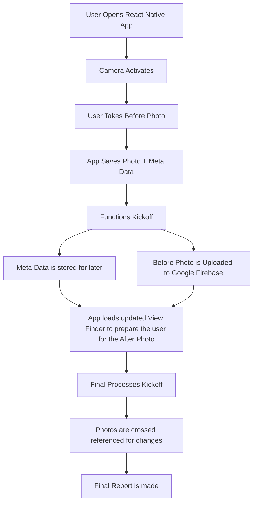

### Full CCC README ↴ | [IDS README Template](https://github.com/Immersion-Data-Solutions/ccc/blob/main/README.md) ⇢ (README.md)

###### Made By Calvin Schmeichel for "CCC" | SCSU Hackathon Spring 2024

# CCC

### Table of Contents
- [1. Overview](https://github.com/Computer-Science-Club-SCSU-University/byteme/tree/main#1-overview--tldr)
- [2. Introduction](https://github.com/Computer-Science-Club-SCSU-University/byteme/tree/main#2-introduction)
- [3. Demo](https://github.com/Computer-Science-Club-SCSU-University/byteme/tree/main#3-demo)
- [4. Technologies](https://github.com/Computer-Science-Club-SCSU-University/byteme/tree/main#4-technologies)
- [5. Looking Forward](https://github.com/Computer-Science-Club-SCSU-University/byteme/tree/main#5-looking-forward)
- [6. Glossary](https://github.com/Computer-Science-Club-SCSU-University/byteme/tree/main#6-glossary)
- [7. Contributors](https://github.com/Computer-Science-Club-SCSU-University/byteme/tree/main#7-contributors)
---
### 1. Overview / TLDR
- For our Spring 2024 Hackathon Project topic we chose the IDS Challenge 1: _Image Capture Pose Mode_.
- IDS uses their Capture mobile app to gather image data for their clients under the "digital twin" platform. One of the key aspects of this process in the "Before and After" Photos.
- _**The problem**_ is it's difficult for the user to take the photo from the exact same view at different times.
- _**Our Solution**_ is to create a program using the React Native framework. By using that we will be able to use a smartphones camera to capture a "Before" photo then use that photo to guide the user when taking the "After" Photo. We also used Python and Google Firebase to achieve this.
---
### 2. Introduction

_Sketch/Draft_

[Pipline](README_Resources/Pipeline_Sketch.png)

_Final_

---
### 3. Demo

---
### 4. Technologies

---
### 5. Looking Forward
- **Business Aspect**
- **Feasibility**

---
### 6. Glossary

---
### 7. Contributors
